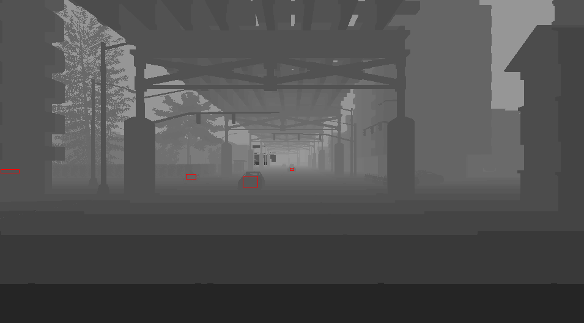

# Automatic Vehicle 2D Bounding Box Annotation Module for CARLA Simulator
### by MukhlasAdib
#### Last edited: June 10th, 2020

As a simulator for autonomous driving development, CARLA offers numerous features ready to use for its users. One of them is feature to extract 3D bounding box of vehicle. But unexpectedly, I couldn’t find any function to retrieve 2D bounding boxes in an image so far. Since I need that function for my thesis research, I made a simple module that can be easily used to get 2D bounding box of visible vehicles in the camera perspective. 

Visit [my github repo](https://github.com/MukhlasAdib/CARLA-2DBBox) to get the pyhton code. Import `carla_vehicle_annotator` to your code, and see how it works by only using one function.

**IMPORTANT**. Some parts of the provided codes are not made by me and copied from a CARLA example code. CARLA Simulator and its example codes are licenced under the terms of MIT Licence. For more information about CARLA, I highly recommend you to visit their website [https://carla.org](https://carla.org).

The 2D bounding boxes are made from the projected 3D bounding box of vehicles in the camera image. Converting 3D bounding box to 2D bounding box is not a hard task, but choosing which vehicles visible to the camera is quite challenging. I use three kinds of filter to do this:

1. Distance filter, this filter will remove vehicles that are separated too far (distance > maximum distance) from the camera. You can set the maximum distance by yourself.
2. Angle filter, this filter will remove vehicles that are outside the camera’s field of view angle.
3. Occlusion filter, this filter will remove vehicles that occluded by other object from the camera view.

Applying distance and angle filters are simple and very intuitive, but applying occlusion filter is a little bit more complicated. Therefore, I will only explain how the occlusion filter works.

The idea of removing non-visible vehicles is by comparing the real distance of the vehicle (distance between camera and vehicle’s center point) with the depth measurement from depth camera. When a vehicle is occluded by a building, for example, the depth camera will return the depth value of the vehicle’s projection pixel in image that is closer than the actual distance of the vehicle. It is because the camera measure the depth of the occluding object, the building in this case. So, we can say that the vehicles that have depth measurement less than the real distance are the occluded vehicles, or real_distance - depth_measurement > 0.

You can’t simply use the above logic to filter the occluded vehicles. Because vehicle has a non-negligible size, the depth values returned by the depth camera will mostly closer than the actual distance to the center of vehicle. This problem will make the algorithm gives you almost no visible vehicle to your camera in any situation. We need some margin value to compensate this effect, I called it ‘depth margin’. The vehicle will be classified as occluded vehicle if real_distance - depth_measurement > depth_margin. 

The figure below illustrates how the algorithm determines whether a vehicle is visible or not. 

Cool, but there is another issue, comparing distance of one point in the world and the depth of one pixel in the image will not gives you reliable result (I have tried it). As the solution, we can compare the actual distance to the center of vehicle with all the pixels inside the bounding box of the vehicle projection, instead of only one pixel. Then, classify vehicles that have 50% of the pixels inside their bounding box meet the depth margin criteria. If you don’t want the 50% threshold, you can change it. I called this threshold parameter as the ‘patch ratio’.

The figure below shows how region in depth image are taken.

Since large part of the bounding box may contain non-vehicle pixels, you can also changing the bounding box size that you use to calculate the depth difference. I called this resize parameter with ‘resize ratio’. You can shrink the box, let’s say to become 50% of the original by setting resize ratio to 0.5. Note that the final output of the bounding boxes is still in the original size. 

The figure below is the RGB image of the previous depth image. The blue boxes is the resized boxes where the data are taken, while the orange boxes are the final bounding boxes. Note that there is a blue box in the left that doesn't has an orange box with it. It means that there is a vehicle in that point, but its bounding box is removed because it is occluded by the building.

Now, there it is! A much more reliable occlusion filter. Still, it is not 100% accurate, but I can assure you that it works most of the time. You can change the value of depth margin, patch ratio, and resize ratio to get the result that you think better. Run test_draw_bb.py to quickly see the algorithm in action. There are some other supplementary functions that you can use, please look at the README explanation in the repo.

Anyway, I am still looking forward the official 2D bounding box extractor by the CARLA team. Also, I would like to express my thanks to the developers since I am using CARLA Simulator for my thesis research. It is very helpful. Thanks a lot!

Good luck and have fun
